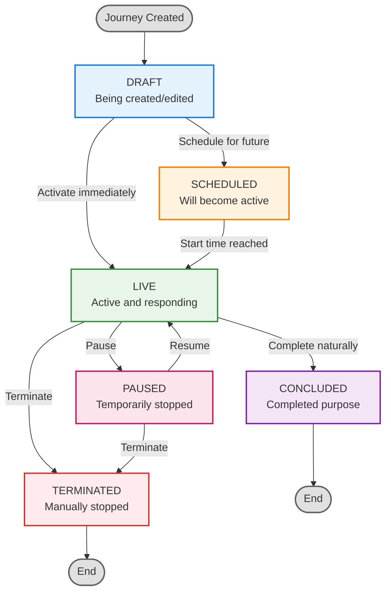

Raven Thunder is a powerful Java 17 + Vert.x platform for managing user journeys and nudges. It provides a comprehensive solution for creating, managing, and delivering contextual user experiences.

## What Thunder Provides

### 🚀 Multi-Module Architecture

Clean separation with `thunder-core`, `thunder-api`, and `thunder-admin` modules. This modular design ensures:
- Clear separation of concerns
- Independent development and deployment
- Easy maintenance and scalability

### 🔌 REST APIs

Complete Admin API (19 endpoints) and SDK/Debug APIs (7 endpoints) for managing Journeys and Nudges:
- **Admin API**: Full CRUD operations for Journeys
- **SDK API**: Client-facing endpoints for fetching user journeys and triggering nudges
- **OpenAPI Documentation**: Auto-generated API documentation with Scalar

### 💾 Aerospike Integration

Reactive data access with RxJava3, complete with:
- Docker setup for local development
- Pre-configured seed data
- Automatic index creation
- Optimized for high-performance, low-latency operations

### 🐳 Docker Ready

Full Docker Compose setup with:
- Aerospike database
- Automatic seed data loading
- Pre-configured indexes
- CORS proxy for web development
- Scalar API documentation server

### ✅ Health Checks

Comprehensive health monitoring for:
- Service availability
- Aerospike connectivity
- Application status
- Dependency checks

### 🧪 Testing

CI with unit and integration tests:
- Automated test suite
- Docker-based integration testing
- Release as Docker images and fat JARs

---

## Core Concepts

Understanding Thunder's core entities is essential for effectively using the platform. This guide explains Journeys (which include Nudges) and Behaviour in detail.

### Journeys

A **Journey** is a configured sequence of steps that responds to user actions. As users perform actions in your application, each action can trigger a step in the Journey. When the user's actions match the configured rules for a step, Thunder displays the corresponding engagement or prompt. Journeys are the primary entities in Thunder that define how the system responds to user behavior, enabling you to deliver contextual experiences based on what users do.

#### Key Features

- **State Machine**: Each Journey uses a state machine to track user progress through different states
- **Rules & Eligibility**: Journeys define who can see them (cohort eligibility) and when they should be shown based on user actions
- **Frequency Control**: Limits how often a user can enter a Journey (per session, time window, or lifetime)
- **Status Management**: Journeys have lifecycle statuses: `DRAFT`, `SCHEDULED`, `LIVE`, `PAUSED`, `CONCLUDED`, `TERMINATED`

#### Journey Components

1. **Basic Information**
   - Name (unique identifier)
   - Description
   - Tags (for categorization)
   - Team (ownership)

2. **Schedule**
   - Start time (optional)
   - End time (optional)

3. **Rules**
   - **Cohort Eligibility**: Define which users are eligible for this Journey
   - **State Transitions**: Define how users move between states based on their actions
   - **Actions**: Define what engagement or prompt to show at each step when user actions match rules
   - **Frequency**: Control how often a user can enter the engagement (per session, within a time window, or lifetime limit)
   - **Priority**: Higher priority Journeys take precedence

4. **State Machine**
   - Tracks user's current state in the Journey
   - Supports multiple active state machines per user
   - Can be reset based on configured conditions

#### Journey Lifecycle

The following diagram shows all possible state transitions for a Journey:



**State Descriptions:**
- **DRAFT**: Being created/edited, not active
- **SCHEDULED**: Will become active at a future time
- **LIVE**: Currently active and responds to user actions based on configured rules
- **PAUSED**: Temporarily stopped, can be resumed
- **CONCLUDED**: Completed its purpose, naturally ended
- **TERMINATED**: Manually stopped, cannot be resumed

#### Nudges

A **Nudge** is a subtle prompt or suggestion aimed at influencing user behaviour without being forceful or intrusive. Nudges are part of Journeys and are displayed when user actions match the configured rules for a Journey step.

Nudges are designed to significantly enhance user experience by providing timely and relevant guidance through prompts. They are dynamically triggered by specific events and conditions in real-time, ensuring that users receive contextual prompts precisely when they need them.


##### Key Characteristics

- **Event-Driven**: Triggered by specific user actions or system events
- **Real-Time**: Delivered based on current user behavior and context
- **Non-Intrusive**: Subtle prompts that don't interrupt user workflow
- **Contextual**: Relevant to the user's current situation and needs
- **Configurable UI**: Customizable presentation

##### Nudge Preview

Thunder provides a preview feature for nudges, allowing you to:
- Test how nudges will appear to users
- Validate nudge content and styling
- Ensure proper rendering before deployment
- Preview different states and scenarios

##### State Machine in Nudges

A **State Machine** is a tool used to model the behavior of a system or feature that moves through a series of predefined stages (or "states") based on specific user actions or events.

**How it Works:**
- Each nudge can have multiple states (e.g., "Not Shown", "Shown", "Dismissed", "Action Taken")
- The system transitions between states based on:
  - User actions (clicks, dismissals, completions)
  - System events (time-based triggers, conditions met)
  - Business rules (frequency limits, eligibility criteria)

**Benefits:**
- Tracks user progress through the nudge flow
- Enables conditional logic (show different content based on state)
- Prevents duplicate or conflicting nudges
- Provides analytics on user engagement at each state

**Example State Flow:**
```
Initial State → Triggered → Shown → User Action → Completed/Dismissed
```

This state-based approach ensures that nudges are delivered at the right time, in the right context, and don't overwhelm users with repetitive prompts.

---

### Behaviour

**Behaviour** enables you to establish relationships between user journeys (Journeys). They allow you to group one or more Journeys under the same behavior and control their overall frequency and visibility.

#### Purpose

Behaviour helps you:
- **Group Related Journeys**: Link multiple Journeys that are part of the same user journey or campaign
- **Control Overall Frequency**: Set frequency limits across all linked Journeys
- **Manage Journey Relationships**: Define rules for when certain Journeys should be shown or hidden based on other Journeys

#### Creating a Behaviour

When creating a Behaviour, you need to configure three main sections:

##### 1. Behaviour Details

**Name** (Mandatory)
- Add a unique name for your behavior
- This name will be used to identify and reference the behaviour

**Description** (Optional)
- Add a description to explain the purpose of this behaviour
- Helps team members understand the behaviour's intent

**Select Journeys**
- All active Journeys will be visible in the dropdown
- Journeys that are already selected by another behaviour will be marked as **disabled**
- You can select one or more Journeys to link to this behaviour

##### 2. Behavior Frequency

The frequency settings for Behaviour work similarly to Journey frequency settings. You can control:

- **Session Frequency**: Maximum number of times the behaviour (across all linked Journeys) can be shown per user session
- **Window Frequency**: Maximum number of times within a specific time window (e.g., per day, per week)
- **Lifespan Frequency**: Maximum number of times in the user's lifetime

This ensures that even if multiple Journeys are linked to a behaviour, the overall exposure is controlled.

##### 3. Journey Validation Rule (Journey Relation)

This section allows you to define relationships between Journeys:

**Show Journey Rules**
- Define when certain Journeys should be shown
- Options:
  - **ANY**: Show if any of the specified Journeys meet conditions
  - **LIST**: Show only if specific Journeys from the list meet conditions
  - **REST**: Show if Journeys not in the specified list meet conditions

**Hide Journey Rules**
- Define when certain Journeys should be hidden
- Uses the same rule types (ANY, LIST, REST)
- Helps prevent conflicting or overlapping Journeys from showing simultaneously

---

## Summary

```
Behaviour
    ├── Links to multiple Journeys
    ├── Controls overall frequency
    └── Manages Journey visibility rules

Journey
    ├── Can be linked to Behaviour
    ├── Has its own state machine
    ├── Contains Nudges(Lightweight prompt/engagement)
    └── Responds to user actions with Nudges
```

---

## Next Steps

- Learn how to create your first Journey (to be added)
- Explore the [API Documentation](/raven-thunder/api/admin-contracts) for integration
- Review [architecture details](/raven-thunder/architecture/modules) for deeper understanding
